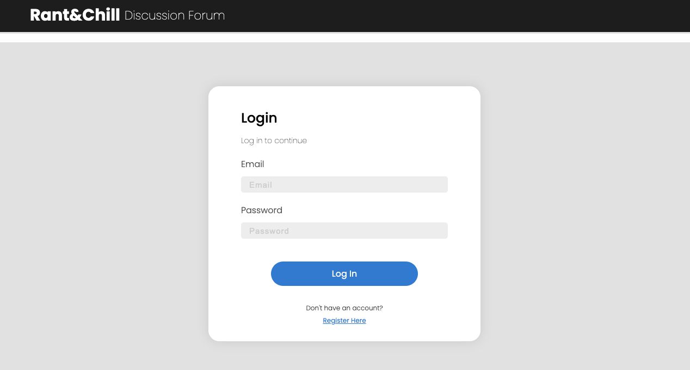
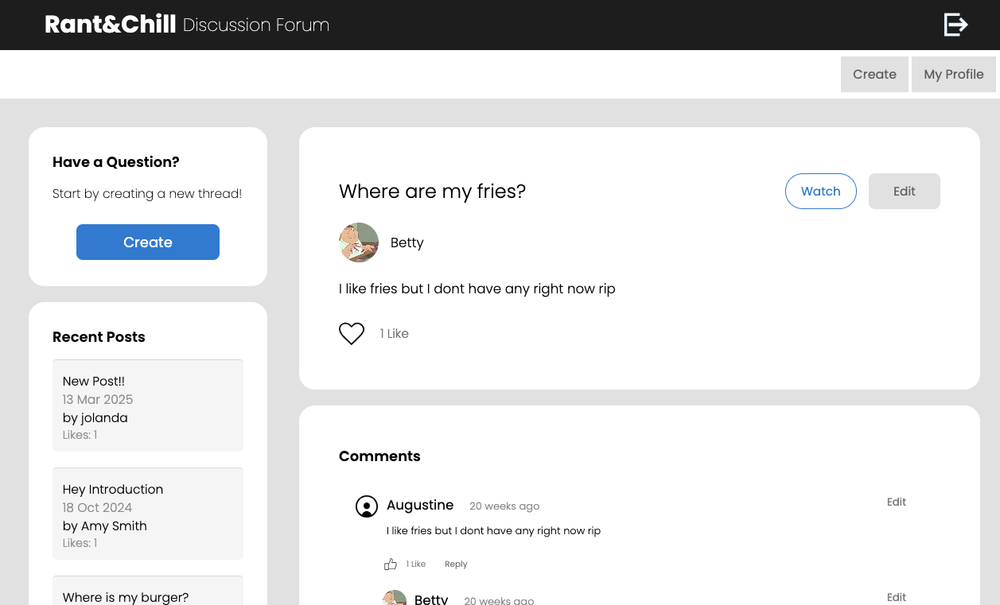
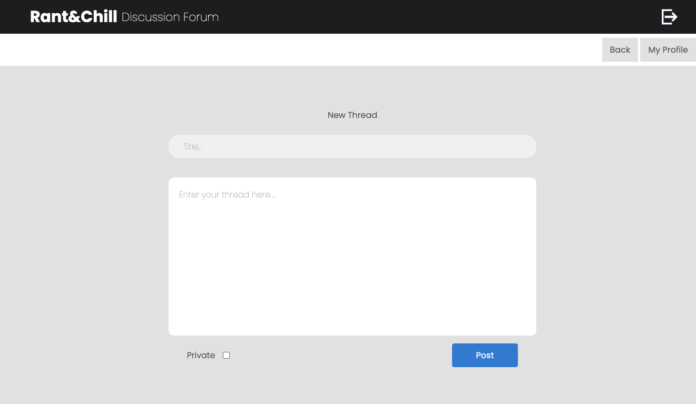
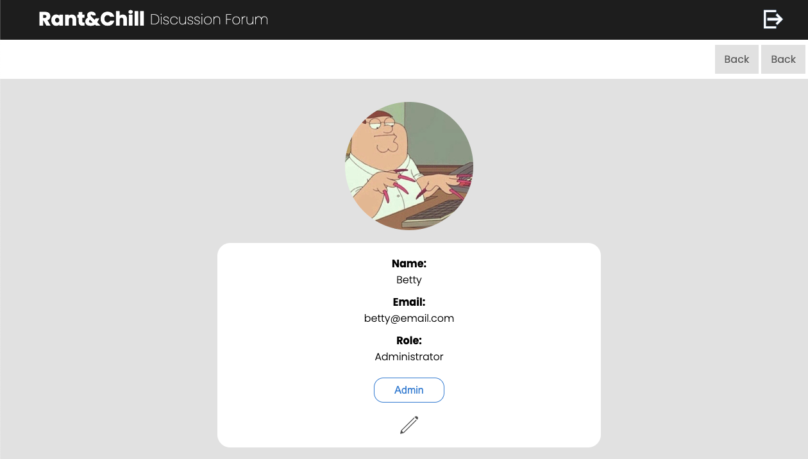

## Rant & Chill

A little side project experimenting with frontend and backend development. This is a fun discussion community forum that lets anyone and everyone chat about anything. Create an account and customise your profile by adding a profile pic :) Start a thread or comment on other 
existing threads. Have fun! 

#### Feature include
* liking threads
* add thread to watchlist
* post comment
* like and reply to comments
* edit or delete your thread

#### Design

#### Login Page

#### Discussion Page

#### Create Thread Page

#### User Profile Page

#### Instructions
In the rac-frontend folder, run `npx http-server frontend -c 1 -p 8080`

In the rac-backend folder, run `npm start`

